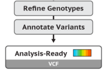

# Bioinformática Instrumental - Módulo II
# Identificação de Variantes Genéticas

## Aula06: Análise de Dados de Variantes Germinativas e Somáticas
Até aqui utilizamos as boas práticas de chamada de variantes preconizadas pelo pacote de ferramentas [GATK](https://software.broadinstitute.org/gatk/) (_Genome Analysis Toolkit_). 

Concluímos a aula passada aplicando filtros de qualidade ("hard filters") às variantes identificadas.   
Aplicamos filtros diferentes para SNVs e INDELs e, por isso, concluímos a etapa de filtros com dois arquivos VCFs para cada amostra (tumor + normal), além de seus respectivos indexes.   

Onde paramos:   
```bash   
aluno30@ea046e981f34:/mnt/curso/aluno30/calling/hardFilters$ ls -1 TCGA_HF_*vcf   
TCGA_HF_SNP.vcf   
TCGA_HF_SNP.vcf.idx   
TCGA_HF_INDEL.vcf
TCGA_HF_INDEL.vcf.idx   
```  

Nesta etapa excluiremos as variantes marcadas como "HardFilter_SNP/INDEL" (Filter Variants) e prosseguiremos com a [anotação](https://en.wikipedia.org/wiki/SNP_annotation) (Annotate Variants). Seguiremos os passos indicados pelas boas práticas  GATK; porém, utilizando outras ferramentas de anotação.   
   

### PASSO 1: ACESSO AO SERVIDOR REMOTO BIOINFO
Para relembrar como fazer a conexão ao servidor remoto via Putty, reveja os passos no Canvas (ModuloII-Aula04).   

### PASSO 2: ORGANIZAR ESTRUTURA DE DIRETÓRIOS NO SERVIDOR REMOTO
No prompt da linha de comando no servidor remoto, criar diretório ```refinement/``` para filtrar, anotar e analisar os dados de variantes. Por fim, salve na pasta ```/filter```  os arquivos VCFs pós-*hardfilters* e crie um link simbólico para o genoma de referência **hg38**.   

```bash   
aluno30@ea046e981f34:/mnt/curso/aluno30$ mkdir refinement   
aluno30@ea046e981f34:/mnt/curso/aluno30$ cd refinement
aluno30@ea046e981f34:/mnt/curso/aluno30/refinement$ mkdir filter  
aluno30@ea046e981f34:/mnt/curso/aluno30/refinement$ mkdir annotation   
aluno30@ea046e981f34:/mnt/curso/aluno30/refinement$ ls    #confira os diretórios criados   
aluno30@ea046e981f34:/mnt/curso/aluno30/refinement$ cd filter   
aluno30@ea046e981f34:/mnt/curso/aluno30/refinement/filter$ ln -s ../../calling/hardFilters/TCGA_HF_* .  
aluno30@ea046e981f34:/mnt/curso/aluno30/refinement/filter$ ln -s /mnt/dados/aula4/hg38   #link simbólico para pasta com arquivos do hg38.   
aluno30@ea046e981f34:/mnt/curso/aluno30/refinement/filter$ ls #confira os links simbólicos criados   
TCGA_HF_INDEL.vcf  TCGA_HF_INDEL.vcf.idx  TCGA_HF_SNP.vcf  TCGA_HF_SNP.vcf.idx  hg38   
```  

### PASSO 3: FILTRO DE VARIANTES (ESCORES DE QUALIDADE)   
Neste passo, para prosseguir com a anotação de variantes propriamente dita, primeiro excluiremos as variantes que não passaram nos critérios de qualidade aplicados na aula passada. Para tanto, utilizaremos o programa [SelectVariants](https://software.broadinstitute.org/gatk/documentation/tooldocs/current/org_broadinstitute_hellbender_tools_walkers_variantutils_SelectVariants.php) que também utilizamos na aula passada para separar SNVs e INDELs. 

Seguiremos analisando SNVs e INDELs separadamente para cada amostra (tumor e tecido normal) e, por isso, na mesma linha de comando separaremos as amostras unidas pela *joint genotyping* com o parâmeto ```-sn TCGA-BH-A1F0-01A``` e ```-sn TCGA-BH-A1F0-11B```.  

Excluiremos do VCFs as variantes de baixa qualidade com o parâmetro ```--exclude-filtered true```, mantendo apenas SNPs e INDELs com valores de FILTER **PASS**. Também excluiremos as posições não-variantes (genótipos ./. ou 0/0), que são resultado da *joint analysis*, com o comando ```--exclude-non-variants true```. Reportamos apenas o que difere do genoma de referência (hg38).   

Por fim, para podermos concluir a anotação nesta aula, restringiremos a análise para o **cromossomo 17** (onde encontramos os genes *BRCA1* e *TP53*). Com o comando ```-L chr17``` definimos um intervalo genômico, um cromosomo inteiro, ou mesmo uma lista de intervalos genômicos.  

**FILTRO DE SNPs PARA CADA AMOSTRA:**   
```bash   
aluno30@ea046e981f34:/mnt/curso/aluno30/refinement/filter$ gatk --java-options "-Xmx2G" SelectVariants -R hg38/hg38.fa -V TCGA_HF_SNP.vcf -sn TCGA-BH-A1F0-01A --exclude-filtered true --exclude-non-variants true -L chr17 -O TCGA-BH-A1F0-01A_SNP.vcf 2> sel_HF_SNP_01A.log &   
aluno30@ea046e981f34:/mnt/curso/aluno30/refinement/filter$   
aluno30@ea046e981f34:/mnt/curso/aluno30/refinement/filter$ gatk --java-options "-Xmx2G" SelectVariants -R hg38/hg38.fa -V TCGA_HF_SNP.vcf -sn TCGA-BH-A1F0-11B --exclude-filtered true --exclude-non-variants true -L chr17 -O TCGA-BH-A1F0-11B_SNP.vcf 2> sel_HF_SNP_11B.log &   
```   
**FILTRO DE INDELs PARA CADA AMOSTRA:**   
```bash   
aluno30@ea046e981f34:/mnt/curso/aluno30/refinement/filter$ gatk --java-options "-Xmx2G" SelectVariants -R hg38/hg38.fa -V TCGA_HF_INDEL.vcf -sn TCGA-BH-A1F0-01A --exclude-filtered true  --exclude-non-variants true -L chr17 -O TCGA-BH-A1F0-01A_INDEL.vcf 2> sel_HF_INDEL_01A.log &   
aluno30@ea046e981f34:/mnt/curso/aluno30/refinement/filter$ 
aluno30@ea046e981f34:/mnt/curso/aluno30/refinement/filter$ gatk --java-options "-Xmx2G" SelectVariants -R hg38/hg38.fa -V TCGA_HF_INDEL.vcf -sn TCGA-BH-A1F0-11B --exclude-filtered true  --exclude-non-variants true -L chr17 -O TCGA-BH-A1F0-11B_INDEL.vcf 2> sel_HF_INDEL_11B.log &   
```   


### PASSO 7: ANOTAÇÃO DOS VCFs  
Neste passo, utilizamos o programa [Annovar](http://annovar.openbioinformatics.org/en/latest/) para adicionar informações genômicas, funcionais e populacionais às variantes identificadas.  

Adicionaremos estas informações:  
> **Genes e transcritos:** RefSeq ([NCBI RefSeqGenes](https://www.ncbi.nlm.nih.gov/refseq/rsg/about/))  
> **Frequência populacional:** Exome Aggregation Consortium ([ExAC](http://exac.broadinstitute.org/))  
> **Banco de mutações somáticas:** Catalogue of Somatic Mutations in Cancer ([COSMIC](https://cancer.sanger.ac.uk/cosmic)) 
